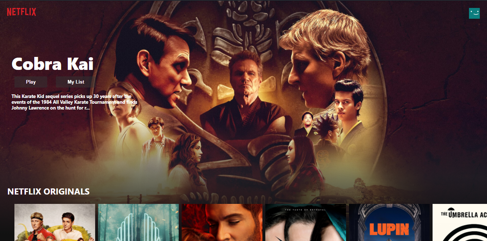

# Netflix Clone

A clone of Netflix's browse page using [React JS](https://reactjs.org) for the front-end and the [TMDB](https://www.themoviedb.org) API for the data. Inspired by [this tutorial](https://www.youtube.com/watch?v=XtMThy8QKqU)

## Requirements

Assuming you have [npm](https://www.npmjs.com) installed, clone the repo and run the following code:

```
npm install
```

## Usage

Inside the cloned folder run:

```
npm start
```

## Example

<p align="center">
   
</p>
