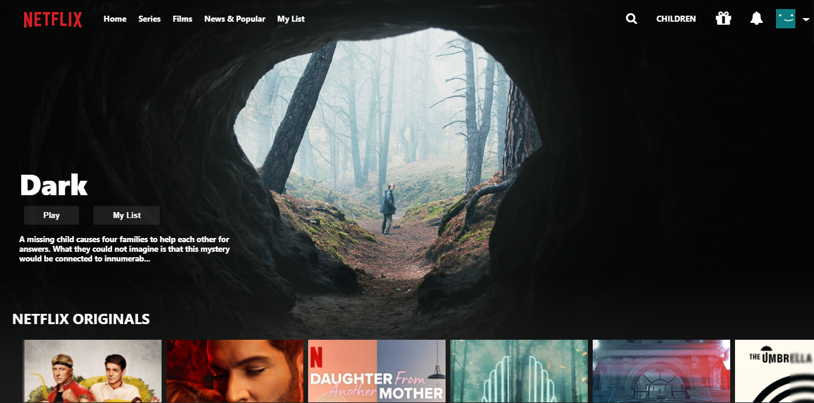

# Netflix Clone

A Netflix clone using [React JS](https://reactjs.org) & [Redux JS](https://redux.js.org) for the front-end, the [TMDB](https://www.themoviedb.org) API for the data and [Firebase](https://firebase.google.com) for authorization and authentication. Inspired by [this tutorial](https://www.youtube.com/watch?v=XtMThy8QKqU)

## Requirements

Assuming you have [npm](https://www.npmjs.com) installed, clone the repo and run the following code:

```
npm install
```

## Usage

Inside the cloned folder run:

```
npm start
```

## Example

<p align="center">
   
</p>
